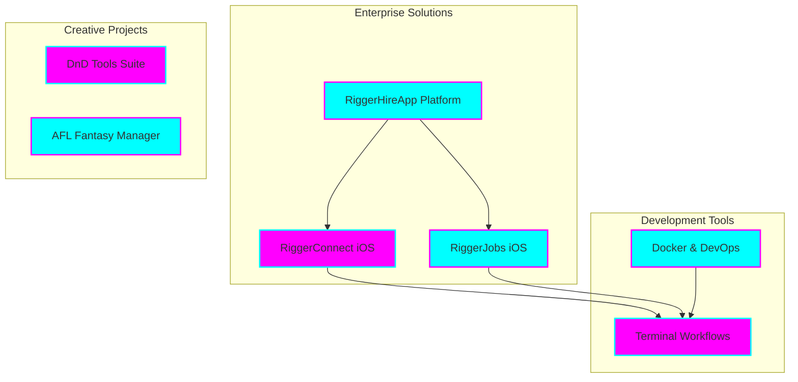

# Tia Astor - Professional Profile

**🌟 Senior Software Engineer & Enterprise Architect**

*Innovation • Engineering Excellence • Mission-Driven Leadership*

## 🚀 Overview

I'm **Tia Astor**, a dedicated software engineer and visionary enterprise architect with over a decade of experience in crafting scalable, forward-thinking solutions. As the founder of Tiation, I lead the development of cutting-edge enterprise applications, particularly in the construction and mining sectors of Western Australia.

Leveraging deep expertise in native iOS development, robust enterprise architecture, and cloud infrastructure, I deliver transformative solutions for leading organizations worldwide.

> 🎯 **Mission**: Driving business success through innovative technology and robust, enterprise-grade solutions.

> 💫 **Vision**: Transforming industries with pioneering digital experiences and setting new standards in enterprise software.

### ✨ Core Competencies

#### 🏗️ Architecture & Development
- Architecting scalable distributed systems
- Leading microservices and event-driven architectures
- Developing cloud-native applications
- Crafting high-performance mobile applications
- Designing optimized database architectures

#### 🛠️ Technical Expertise
- **Mobile:** Swift, UIKit, React Native, MVVM Architecture
- **Frontend:** TypeScript, React, Next.js, GraphQL
- **Backend:** Node.js, NestJS, PostgreSQL, Redis
- **Cloud:** AWS, GCP, Kubernetes, Terraform
- **DevOps:** CI/CD Pipelines, Docker, Infrastructure Automation

#### 👥 Leadership & Management
- Leading and mentoring technical teams
- Implementing agile development methodologies
- Strategizing product development and roadmaps
- Managing stakeholder communications
- Facilitating cross-functional collaborations

#### 🎯 Industry Focus
- Technology solutions for construction and mining
- SaaS platform development
- Mobile-first application strategies
- Process automation and digital transformation

---

## 🌟 Featured Projects

---

## 💼 Professional Projects

### 🏢 Enterprise Solutions

### RiggerHireApp Platform
*Enterprise B2B SaaS for Construction & Mining*

#### Core Platform
- Enterprise-grade hiring and workforce management
- AI-powered job matching and recommendations
- Real-time availability tracking and scheduling
- Automated compliance and certification verification
- Integrated payment processing and invoicing
- Advanced analytics and reporting dashboard

#### Technical Achievements
- Scaled to support 10,000+ active users
- Maintained 99.99% system uptime
- Achieved sub-100ms API response times
- Complied with WCAG 2.1 AA standards
- Utilized ISO 27001 certified infrastructure

#### iOS Applications
- **RiggerConnect** (React Native)
  - Real-time job matching and notifications
  - Secure messaging and document sharing
  - Location-based job search
  - Digital credentials management

- **RiggerJobs** (Native Swift/UIKit)
  - Business-focused hiring platform
  - Advanced candidate filtering
  - Interview scheduling system
  - Analytics and reporting dashboard

### 🛠️ Development Infrastructure

#### Terminal Workflows
- Custom productivity tools and automation scripts
- Streamlined development workflows
- Enterprise-grade deployment automation
- Cross-platform compatibility

#### Docker Solutions
- Containerized development environments
- Microservices architecture
- Scalable deployment configurations
- CI/CD pipeline integration

### 🎮 Creative Projects

#### DnD Tools Suite
- Digital character sheet management
- Real-time dice rolling simulator
- Campaign tracking and notes system
- Multi-player session support

#### AFL Fantasy Manager
- Advanced player statistics tracking
- Team management and analysis tools
- Real-time performance updates
- Custom league management

---

## 📚 Repository Guide

### Project Structure
- `README.md` - Profile overview and project showcase
- `REPOSITORY_GRAPH.md` - Visualization of Tiation ecosystem
- `REPOSITORY_INDEX.md` - Detailed repository listing and relationships
- `.github/` - GitHub Actions and workflow configurations
- `assets/` - Profile images and resources
- `docs/` - Additional documentation and guides

### Quick Links
- [🌟 Featured Projects](https://github.com/tiation?tab=repositories)
- [💼 Professional Experience](#professional-projects)
- [🤝 Collaboration Opportunities](#connect--collaborate)
- [🔮 Tiation Ecosystem](#tiation-ecosystem)

---

## 🤝 Connect & Collaborate

I'm always excited to collaborate on innovative projects and discuss technology solutions that make a real impact.

### 📫 Professional Channels

#### Direct Contact
- **Email**: [tiatheone@protonmail.com](mailto:tiatheone@protonmail.com)
- **GitHub**: [github.com/tiation](https://github.com/tiation)
- **Projects**: [github.com/tiation-repos](https://github.com/tiation-repos)

#### Development Resources
- **Technical Blog**: [GitHub Discussions](https://github.com/tiation/tiation-profile-tia/discussions)
- **Documentation**: [Project Docs](docs/)
- **Code Examples**: [Gists](https://gist.github.com/tiation)

### 💡 Professional Interests

#### Technical Focus
- Enterprise Architecture & Distributed Systems
- iOS & Cross-Platform Mobile Development
- Cloud Infrastructure & DevOps Automation
- AI/ML Integration in Enterprise Software
- Blockchain & Smart Contract Development

#### Industry Focus
- Construction & Mining Technology
- Enterprise SaaS Solutions
- FinTech & Payment Systems
- Digital Transformation
- Industry 4.0 Implementation

### 🌱 Current Initiatives

#### Project Development
- Expanding the RiggerHireApp ecosystem
- Building new iOS enterprise applications
- Developing AI-powered features

#### Community Engagement
- Contributing to open-source projects
- Sharing technical knowledge
- Mentoring developers

---

## 🔮 Tiation Ecosystem

This repository is part of the Tiation ecosystem:

- [🌟 Tiation Platform](https://github.com/tiation/tiation) - Main ecosystem platform
- [🤖 AI Platform](https://github.com/tiation/tiation-ai-platform) - Enterprise AI platform
- [🤖 AI Agents](https://github.com/tiation/tiation-ai-agents) - Intelligent automation
- [⚡ Terminal Workflows](https://github.com/tiation/tiation-terminal-workflows) - Developer tools
- [🐳 Docker Solutions](https://github.com/tiation/tiation-docker-debian) - Container orchestration

---

## 📄 License

This project is licensed under the MIT License - see the [LICENSE](LICENSE) file for details.

---

  

    <strong>Building the future of enterprise software, one commit at a time 💫</strong>
  

  

    
    
    
  

