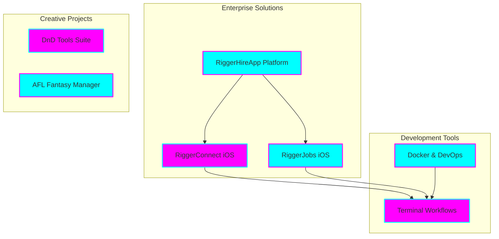

# Tia Astor - Professional Profile

**🌟 Senior Software Engineer & Enterprise Architect**

*Innovation • Engineering Excellence • Mission-Driven Leadership*

## 🚀 Overview

I'm **Tia Astor**, a passionate software engineer and enterprise architect specializing in building scalable, innovative solutions. As the founder of Tiation, I lead the development of enterprise-grade applications with a focus on the construction and mining industries in Western Australia.

> 🎯 **Mission**: Empowering businesses through innovative technology and enterprise-grade solutions that drive real-world impact.

### ✨ Areas of Expertise

- 🎯 **Enterprise Architecture** - Designing and implementing scalable, production-ready systems
- 🔧 **Full-Stack Development** - Specializing in TypeScript, React Native, and Swift
- 🌟 **Mobile-First Solutions** - Creating intuitive, responsive applications for iOS and web platforms
- 🛡️ **Security & Compliance** - Ensuring robust security practices and industry standard compliance

---

## 🏗️ Key Projects & Contributions

---

## 📦 Featured Projects

### RiggerHireApp Platform
A comprehensive B2B SaaS solution for the construction and mining industries in Western Australia, facilitating the connection between businesses and skilled workers.

### iOS Applications
- **RiggerConnect**: React Native app for connecting riggers with job opportunities
- **RiggerJobs**: Native Swift/UIKit app for businesses to post and manage job listings

### Development Tools
- **Terminal Workflows**: Custom automation and productivity tools for developers
- **Docker Solutions**: Enterprise-grade container orchestration and deployment

### Creative Projects
- **DnD Tools Suite**: Digital tools for Dungeons & Dragons enthusiasts
- **AFL Fantasy Manager**: Sports management and analytics platform

---

## 📚 Documentation

- **[Project Documentation](docs/)** - Complete project documentation
- **[API Reference](docs/api.md)** - API documentation (if applicable)
- **[Contributing Guide](CONTRIBUTING.md)** - How to contribute to this project

---

## 🤝 Connect With Me

I'm always interested in collaborating on innovative projects and discussing technology solutions.

### Get in Touch

- 📧 Email: tiatheone@protonmail.com
- 💼 GitHub: [github.com/tiation](https://github.com/tiation)
- 🌐 Projects: [github.com/tiation-repos](https://github.com/tiation-repos)

---

## 🔮 Tiation Ecosystem

This repository is part of the Tiation ecosystem:

- [🌟 Tiation Platform](https://github.com/tiation/tiation) - Main ecosystem platform
- [🤖 AI Platform](https://github.com/tiation/tiation-ai-platform) - Enterprise AI platform
- [🤖 AI Agents](https://github.com/tiation/tiation-ai-agents) - Intelligent automation
- [⚡ Terminal Workflows](https://github.com/tiation/tiation-terminal-workflows) - Developer tools
- [🐳 Docker Solutions](https://github.com/tiation/tiation-docker-debian) - Container orchestration

---

## 📄 License

This project is licensed under the MIT License - see the [LICENSE](LICENSE) file for details.

---

  

    <strong>Building the future of enterprise software, one commit at a time 💫</strong>
  

  

    
  

