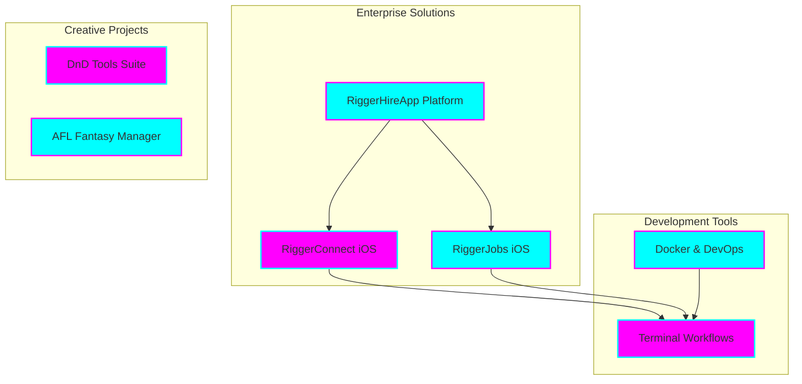

# Tia Astor - Professional Profile

**🌟 Senior Software Engineer & Enterprise Architect**

*Innovation • Engineering Excellence • Mission-Driven Leadership*

## 🚀 Overview

I'm **Tia Astor**, a passionate software engineer and enterprise architect specializing in building scalable, innovative solutions. As the founder of Tiation, I lead the development of enterprise-grade applications with a focus on the construction and mining industries in Western Australia.

> 🎯 **Mission**: Empowering businesses through innovative technology and enterprise-grade solutions that drive real-world impact.

### ✨ Core Competencies

#### 🏗️ Architecture & Development
- Enterprise-grade system architecture and scalable infrastructure design
- Full-stack development with TypeScript, Node.js, and modern frameworks
- Native iOS (Swift/UIKit) and cross-platform (React Native) mobile development
- Cloud infrastructure and containerization (Docker, Kubernetes)

#### 🛠️ Technical Leadership
- Leading development teams and driving technical decisions
- Implementing CI/CD pipelines and DevOps best practices
- Code quality assurance and performance optimization
- Security-first development approach

#### 🎯 Industry Focus
- Construction and mining industry solutions
- B2B SaaS platform development
- Enterprise mobile applications
- Automation and workflow optimization

---

## 🌟 Featured Projects

---

## 💼 Professional Projects

### 🏢 Enterprise Solutions

#### RiggerHireApp Platform
*B2B SaaS Platform for Construction & Mining*
- Enterprise-grade hiring platform for skilled workers
- Comprehensive business management dashboard
- Advanced matching algorithm for job placements
- Integrated payment and invoicing system

#### iOS Applications
- **RiggerConnect** (React Native)
  - Real-time job matching and notifications
  - Secure messaging and document sharing
  - Location-based job search
  - Digital credentials management

- **RiggerJobs** (Native Swift/UIKit)
  - Business-focused hiring platform
  - Advanced candidate filtering
  - Interview scheduling system
  - Analytics and reporting dashboard

### 🛠️ Development Infrastructure

#### Terminal Workflows
- Custom productivity tools and automation scripts
- Streamlined development workflows
- Enterprise-grade deployment automation
- Cross-platform compatibility

#### Docker Solutions
- Containerized development environments
- Microservices architecture
- Scalable deployment configurations
- CI/CD pipeline integration

### 🎮 Creative Projects

#### DnD Tools Suite
- Digital character sheet management
- Real-time dice rolling simulator
- Campaign tracking and notes system
- Multi-player session support

#### AFL Fantasy Manager
- Advanced player statistics tracking
- Team management and analysis tools
- Real-time performance updates
- Custom league management

---

## 📚 Repository Guide

### Project Structure
- `README.md` - Profile overview and project showcase
- `REPOSITORY_GRAPH.md` - Visualization of Tiation ecosystem
- `REPOSITORY_INDEX.md` - Detailed repository listing and relationships
- `.github/` - GitHub Actions and workflow configurations
- `assets/` - Profile images and resources
- `docs/` - Additional documentation and guides

### Quick Links
- [🌟 Featured Projects](https://github.com/tiation?tab=repositories)
- [💼 Professional Experience](#professional-projects)
- [🤝 Collaboration Opportunities](#connect--collaborate)
- [🔮 Tiation Ecosystem](#tiation-ecosystem)

---

## 🤝 Connect & Collaborate

I'm always excited to collaborate on innovative projects and discuss technology solutions that make a real impact.

### 📫 Get in Touch

- **Email**: [tiatheone@protonmail.com](mailto:tiatheone@protonmail.com)
- **GitHub**: [github.com/tiation](https://github.com/tiation)
- **Projects**: [github.com/tiation-repos](https://github.com/tiation-repos)

### 💡 Areas of Interest

- Enterprise Architecture & System Design
- Mobile Application Development
- Cloud Infrastructure & DevOps
- B2B SaaS Solutions
- Technical Leadership & Team Building

### 🌱 Current Focus

- Expanding the RiggerHireApp ecosystem
- Developing new iOS applications
- Contributing to open-source projects
- Building developer tools and workflows

---

## 🔮 Tiation Ecosystem

This repository is part of the Tiation ecosystem:

- [🌟 Tiation Platform](https://github.com/tiation/tiation) - Main ecosystem platform
- [🤖 AI Platform](https://github.com/tiation/tiation-ai-platform) - Enterprise AI platform
- [🤖 AI Agents](https://github.com/tiation/tiation-ai-agents) - Intelligent automation
- [⚡ Terminal Workflows](https://github.com/tiation/tiation-terminal-workflows) - Developer tools
- [🐳 Docker Solutions](https://github.com/tiation/tiation-docker-debian) - Container orchestration

---

## 📄 License

This project is licensed under the MIT License - see the [LICENSE](LICENSE) file for details.

---

  

    <strong>Building the future of enterprise software, one commit at a time 💫</strong>
  

  

    
    
    
  

