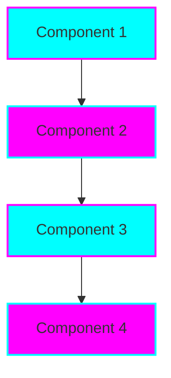

# TiaAstor

<div align="center">


**👋 Welcome to **TiaAstor** - the personal brand and professional identity of **Tia Astor**, a passionate developer and innovator in the technology space.

🌟 This repository serves as the central hub for showcasing my professional journey, technical expertise, and commitment to creating impactful software solutions. As the flagship repository of the Tiation ecosystem, it represents my dedication to enterprise-grade development and social impact through technology.

### 🎯 What You'll Find Here

- **Professional Portfolio**: Comprehensive showcase of my technical skills and achievements
- **Project Gallery**: Curated collection of my most impactful work
- **Technical Expertise**: Deep dive into my core competencies and specializations
- **Career Journey**: Professional timeline and key milestones
- **Community Contributions**: Open source projects and developer community involvement**

*Professional • Scalable • Mission-Driven*

[](https://tiation.github.io/TiaAstor)
[](https://tiation.github.io/TiaAstor)
[](https://tiation.github.io/TiaAstor/architecture)
[](https://github.com/tiation/TiaAstor)
[](https://github.com/tiation/TiaAstor/blob/main/LICENSE)

</div>

## 🚀 Overview

👋 Welcome to **TiaAstor** - the personal brand and professional identity of **Tia Astor**, a passionate developer and innovator in the technology space.

🌟 This repository serves as the central hub for showcasing my professional journey, technical expertise, and commitment to creating impactful software solutions. As the flagship repository of the Tiation ecosystem, it represents my dedication to enterprise-grade development and social impact through technology.

### 🎯 What You'll Find Here

- **Professional Portfolio**: Comprehensive showcase of my technical skills and achievements
- **Project Gallery**: Curated collection of my most impactful work
- **Technical Expertise**: Deep dive into my core competencies and specializations
- **Career Journey**: Professional timeline and key milestones
- **Community Contributions**: Open source projects and developer community involvement

### 💼 Professional Focus

As a technology leader, I specialize in building scalable, enterprise-grade solutions that drive business value and social impact. My work spans across multiple domains including AI/ML, infrastructure automation, web development, and community-driven technology initiatives.

### 🌟 Core Values

- **Innovation**: Pushing the boundaries of what's possible with technology
- **Quality**: Delivering enterprise-grade solutions with attention to detail  
- **Impact**: Creating technology that makes a meaningful difference
- **Community**: Contributing to open source and developer communities
- **Sustainability**: Building solutions that are environmentally and socially responsible

---

## 🏗️ Architecture


### System Components



### Technology Stack

- **Languages**: Python, JavaScript, TypeScript, Go, Rust
- **Frameworks**: React, Node.js, Django, FastAPI, Next.js
- **Cloud**: AWS, Docker, Kubernetes, Terraform
- **Databases**: PostgreSQL, MongoDB, Redis, Elasticsearch
- **Tools**: Git, CI/CD, Monitoring, Testing Frameworks

---

## 📋 Table of Contents

- [Features](#-features)
- [Quick Start](#-quick-start)
- [Installation](#-installation)
- [Usage](#-usage)
- [Documentation](#-documentation)
- [Screenshots](#-screenshots)
- [FAQ](#-faq)
- [Contributing](#-contributing)
- [Support](#-support)
- [License](#-license)
- [About Tiation](#-about-tiation)

---

## ✨ Features

- 🏆 **Professional Showcase** - Comprehensive portfolio of technical achievements
- 💡 **Innovation Hub** - Latest projects and experimental technologies
- 🤝 **Community Engagement** - Active participation in developer communities
- 📚 **Knowledge Sharing** - Technical blog posts and educational content
- 🔧 **Tool Development** - Custom utilities and productivity enhancers
- 🌍 **Global Impact** - Projects with social and environmental benefits

---

## 🏃‍♂️ Quick Start

```bash
# Clone the repository
git clone https://github.com/tiation/TiaAstor.git
cd TiaAstor

# Install dependencies
npm install  # or pip install -r requirements.txt

# Run the application
npm start    # or python manage.py runserver
```

---

## 📦 Installation

### Prerequisites

- Node.js 18+ or Python 3.9+
- Git
- Modern web browser

### Installation Steps

1. **Clone the repository**
   ```bash
   git clone https://github.com/tiation/TiaAstor.git
   cd TiaAstor
   ```

2. **Install dependencies**
   ```bash
   npm install
   # For Python projects: pip install -r requirements.txt
   ```

3. **Configuration**
   ```bash
   cp .env.example .env
   # Edit configuration as needed
   ```

---

## 🎯 Usage

### Basic Usage

Visit the live demo or explore the documentation for detailed usage instructions.

### Advanced Usage

See the Developer Guide for advanced customization options.

### Examples

Check the examples/ directory for practical implementation examples.

---

## 📚 Documentation

- **[User Guide](docs/user-guide.md)** - Complete user documentation
- **[API Reference](docs/api-reference.md)** - Technical API documentation
- **[Architecture](docs/architecture.md)** - System architecture overview
- **[Deployment Guide](docs/deployment.md)** - Production deployment instructions
- **[Developer Guide](docs/developer-guide.md)** - Development setup and guidelines

### Live Documentation

Visit our [GitHub Pages site](https://tiation.github.io/TiaAstor) for interactive documentation.

---

## 📸 Screenshots

<div align="center">
  
  <p><em>Main application interface</em></p>
</div>

<div align="center">
  
  <p><em>Analytics dashboard</em></p>
</div>

---

## ❓ FAQ

### General Questions

**Q: What makes this solution enterprise-grade?**
A: Our solution includes comprehensive security, scalability, monitoring, and enterprise integration features with professional support.

**Q: Is this compatible with existing systems?**
A: Yes, we provide extensive API and integration capabilities for seamless system integration.

**Q: What support options are available?**
A: We offer community support through GitHub Issues and professional enterprise support for commercial users.

### Technical Questions

**Q: What are the system requirements?**
A: Modern web browser, Node.js 18+, or Python 3.9+

**Q: How do I handle large scale deployments?**
A: See our [Deployment Guide](docs/deployment.md) for enterprise-scale deployment strategies.

**Q: Are there any security considerations?**
A: Yes, please review our [Security Guide](docs/security.md) for comprehensive security best practices.

### Troubleshooting

**Q: Common installation issues**
A: Check our [Troubleshooting Guide](docs/troubleshooting.md) for solutions to common problems.

**Q: Performance optimization**
A: Refer to our [Performance Guide](docs/performance.md) for optimization strategies.

---

## 🤝 Contributing

We welcome contributions! Please see our [Contributing Guide](CONTRIBUTING.md) for details.

### Development Setup

1. Fork the repository
2. Create a feature branch
3. Make your changes
4. Add tests
5. Submit a pull request

### Code of Conduct

Please read our [Code of Conduct](CODE_OF_CONDUCT.md) before contributing.

---

## 🆘 Support

### Community Support

- **GitHub Issues**: [Report bugs or request features](https://github.com/tiation/TiaAstor/issues)
- **Discussions**: [Join community discussions](https://github.com/tiation/TiaAstor/discussions)
- **Documentation**: [Browse our documentation](https://tiation.github.io/TiaAstor)

### Enterprise Support

For enterprise customers, we offer:
- Priority support
- Custom development
- Training and consultation
- SLA guarantees

Contact us at [tiatheone@protonmail.com](mailto:tiatheone@protonmail.com)

---

## 🔮 Tiation Ecosystem

This repository is part of the Tiation ecosystem. Explore related projects:

- [🌟 Tiation Platform](https://github.com/tiation/tiation-ai-platform) - Enterprise AI platform
- [🤖 AI Agents](https://github.com/tiation/tiation-ai-agents) - Intelligent automation
- [⚡ Terminal Workflows](https://github.com/tiation/tiation-terminal-workflows) - Developer tools
- [🐳 Docker Solutions](https://github.com/tiation/tiation-docker-debian) - Container orchestration
- [📝 CMS](https://github.com/tiation/tiation-cms) - Content management system
- [🐰 ChaseWhiteRabbit NGO](https://github.com/tiation/tiation-chase-white-rabbit-ngo) - Social impact initiatives
- [🏗️ Infrastructure](https://github.com/tiation/tiation-rigger-infrastructure) - Enterprise infrastructure
- [🥇 TiaAstor Profile](https://github.com/TiaAstor) - Personal profile and brand identity.

---

## 📄 License

This project is licensed under the MIT License - see the [LICENSE](LICENSE) file for details.

---

## 🌟 About Tiation

**Tiation** is a leading provider of enterprise-grade software solutions, specializing in automation, productivity, and system integration tools. Our mission is to empower organizations with cutting-edge technology that drives efficiency and innovation.

### Our Solutions

- **Automation Platform**: Comprehensive business process automation
- **Developer Tools**: Professional development and deployment tools
- **Enterprise Integration**: Seamless system integration solutions
- **Security Framework**: Advanced security and compliance tools

### Connect With Us

- **Website**: [https://github.com/tiation](https://github.com/tiation)
- **GitHub**: [https://github.com/tiation](https://github.com/tiation)
- **LinkedIn**: [Tiation Company](https://linkedin.com/company/tiation)
- **Twitter**: [@TiationTech](https://twitter.com/TiationTech)

---

<div align="center">
  <p>
    <strong>Built with ❤️ by the Tiation Team</strong>
  </p>
  <p>
    <a href="https://github.com/tiation">
      
    </a>
  </p>
</div>
