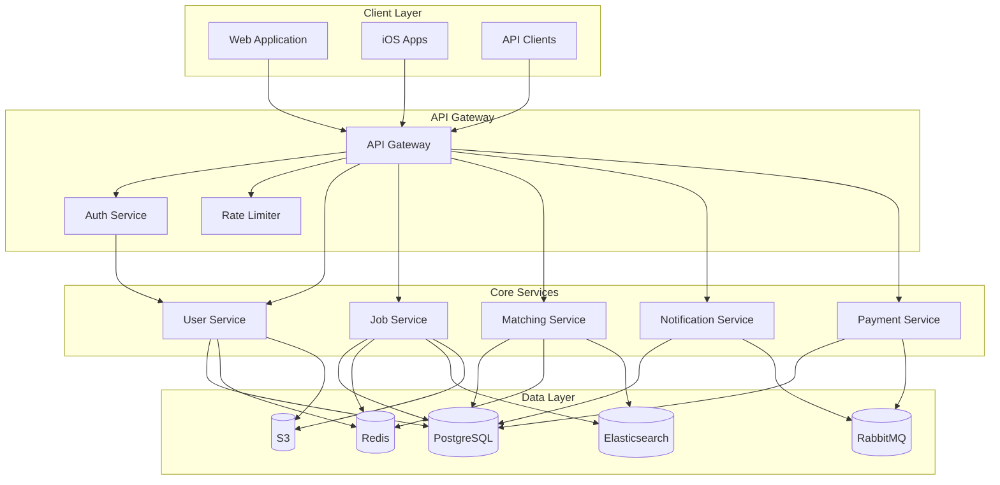
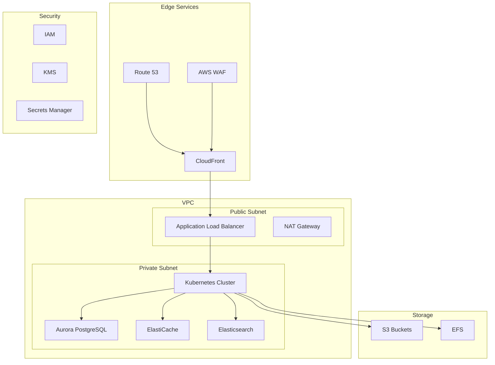
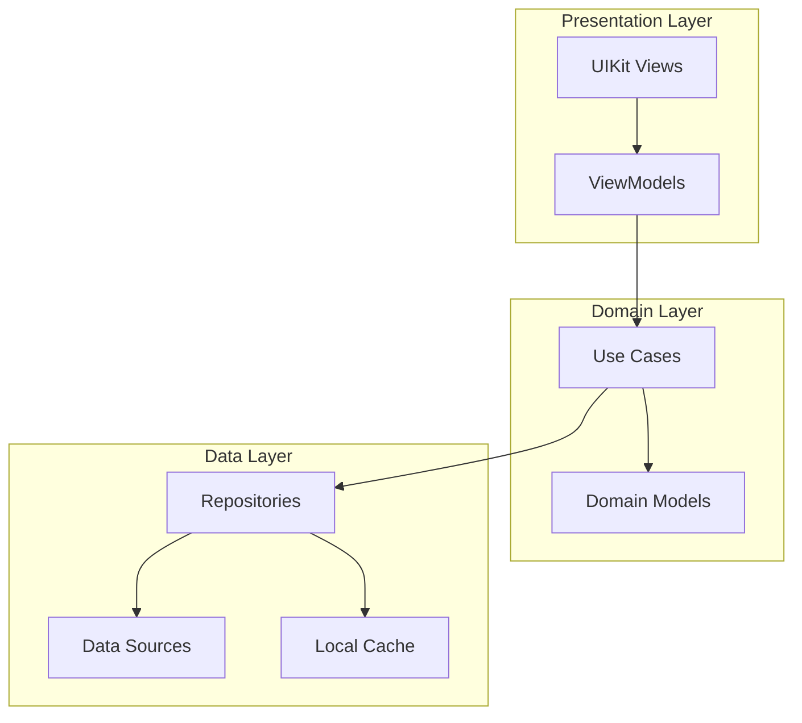
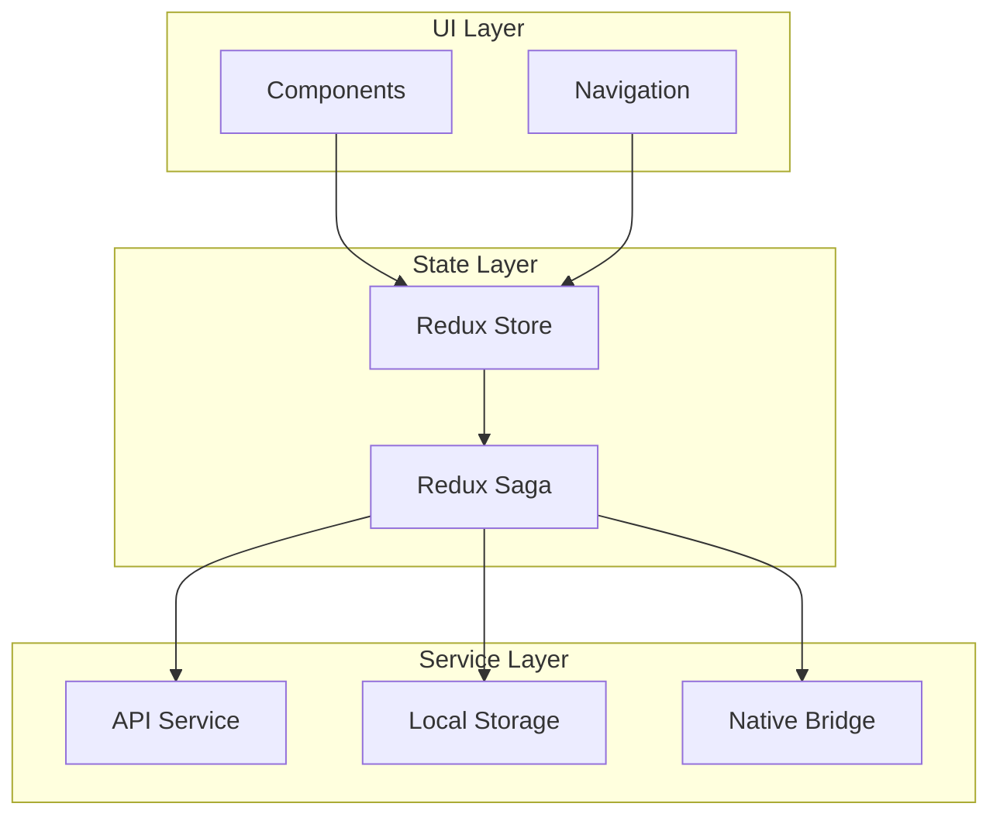

# Enterprise Architecture & System Design

## System Architecture Principles

### Design Philosophy
- Scalable, resilient, and maintainable systems
- Event-driven microservices architecture
- Cloud-native development practices
- Security-first approach
- Performance optimization

### Architectural Patterns
- Domain-Driven Design (DDD)
- Event Sourcing
- CQRS (Command Query Responsibility Segregation)
- Hexagonal Architecture
- Clean Architecture

## RiggerHireApp Platform Architecture

### System Overview

### Service Architecture

#### API Gateway
- Request routing and transformation
- Authentication and authorization
- Rate limiting and throttling
- Request/response logging
- Error handling and monitoring

#### Core Services

##### User Service
- User management and authentication
- Profile management
- Permission and role management
- User preferences and settings
- Activity tracking

##### Job Service
- Job posting and management
- Search and filtering
- Application processing
- Status tracking
- Analytics and reporting

##### Matching Service
- AI-powered job matching
- Candidate ranking
- Skill assessment
- Availability management
- Recommendation engine

##### Notification Service
- Real-time notifications
- Email notifications
- Push notifications
- SMS notifications
- Notification preferences

##### Payment Service
- Payment processing
- Invoice generation
- Transaction management
- Refund handling
- Financial reporting

### Data Architecture

#### Database Design
- Normalized schema design
- Partitioning strategy
- Indexing optimization
- Query optimization
- Data integrity

#### Caching Strategy
- Multi-level caching
- Cache invalidation
- Cache synchronization
- Cache warming
- Performance optimization

#### Search Implementation
- Full-text search
- Geospatial search
- Faceted search
- Search suggestions
- Result ranking

### Security Architecture

#### Authentication
- OAuth2/OpenID Connect
- JWT implementation
- MFA support
- Session management
- Token management

#### Authorization
- RBAC implementation
- Permission management
- Policy enforcement
- Access control
- Audit logging

#### Data Security
- Encryption at rest
- Encryption in transit
- Key management
- Data masking
- Privacy controls

### Infrastructure Architecture

#### AWS Implementation

#### Monitoring & Observability
- Metrics collection
- Log aggregation
- Distributed tracing
- Alert management
- Performance monitoring

## Mobile Architecture

### iOS Native (Swift)

### React Native Architecture

