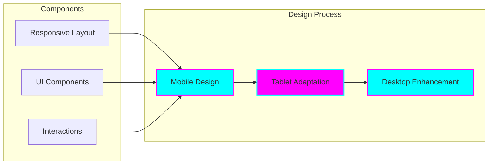
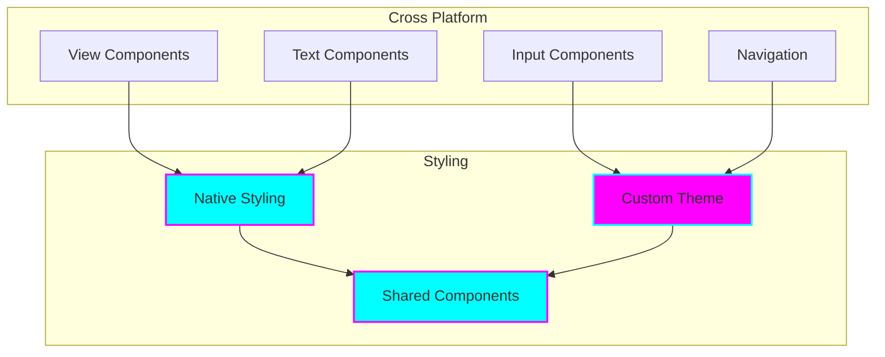

# Enterprise Design System

## Visual Language

### Color System

#### Primary Colors
```css
:root {
  --neon-cyan: #00FFFF;
  --neon-magenta: #FF00FF;
  --dark-bg: #0A0A0A;
  --light-text: #FFFFFF;
}
```

#### Gradients
```css
.primary-gradient {
  background: linear-gradient(135deg, var(--neon-cyan), var(--neon-magenta));
}

.dark-gradient {
  background: linear-gradient(135deg, #000000, #1A1A1A);
}
```

### Theme Implementation

#### Dark Neon Theme
```mermaid
graph TB
    subgraph Theme Components
        BG[Background Colors]
        Text[Typography]
        Accent[Accent Colors]
        Effect[Effects]
    end

    subgraph Implementation
        Dark[Dark Base]
        Neon[Neon Accents]
        Gradient[Gradients]
        Glow[Glow Effects]
    end

    BG --> Dark
    Text --> Dark
    Accent --> Neon
    Effect --> Glow
    
    Dark --> Gradient
    Neon --> Gradient
    Gradient --> Glow

    style Dark fill:#0A0A0A,stroke:#1A1A1A,color:#FFFFFF
    style Neon fill:#00FFFF,stroke:#FF00FF,stroke-width:2px
    style Gradient fill:url(#gradient),stroke:#FF00FF
    style Glow fill:#0A0A0A,stroke:#00FFFF,stroke-width:3px
```

## Design Principles

### Mobile-First Approach


### Component Library

#### Base Components
- Buttons
- Input Fields
- Cards
- Navigation
- Modals

#### Interactive Elements
- Hover States
- Focus States
- Active States
- Loading States
- Error States

#### Animation System
- Transitions
- Transforms
- Keyframes
- Hover Effects
- Loading Animations

## Enterprise UI

### Header System
```css
.enterprise-header {
  background: var(--dark-bg);
  border-bottom: 2px solid var(--neon-cyan);
  box-shadow: 0 0 20px rgba(0, 255, 255, 0.2);
}
```

### Navigation
```css
.nav-item {
  color: var(--light-text);
  border: 1px solid transparent;
  transition: all 0.3s ease;
}

.nav-item:hover {
  border-color: var(--neon-magenta);
  box-shadow: 0 0 10px rgba(255, 0, 255, 0.3);
}
```

### Content Areas
```css
.content-section {
  background: var(--dark-bg);
  border-radius: 8px;
  border: 1px solid var(--neon-cyan);
  padding: 2rem;
}
```

## Mobile Design

### iOS Components

```mermaid
graph TB
    subgraph Native Components
        Nav[Navigation Bar]
        Tab[Tab Bar]
        List[List Views]
        Cards[Card Views]
    end

    subgraph Custom Style
        Theme[Dark Theme]
        Accent[Neon Accents]
        Animation[Animations]
    end

    Nav --> Theme
    Tab --> Theme
    List --> Theme
    Cards --> Theme

    Theme --> Accent
    Accent --> Animation

    style Theme fill:#0A0A0A,stroke:#00FFFF,stroke-width:2px
    style Accent fill:#FF00FF,stroke:#00FFFF,stroke-width:2px
    style Animation fill:#00FFFF,stroke:#FF00FF,stroke-width:2px
```


### React Native Components


## Accessibility

### WCAG Compliance
- Color Contrast
- Focus Indicators
- Semantic HTML
- ARIA Labels
- Keyboard Navigation

### Dark Mode Support
```css
@media (prefers-color-scheme: dark) {
  :root {
    --bg-primary: #0A0A0A;
    --text-primary: #FFFFFF;
    --accent-primary: #00FFFF;
    --accent-secondary: #FF00FF;
  }
}
```

## Responsive Design

### Breakpoints
```css
/* Mobile First */
@media (min-width: 640px) {
  /* Tablet */
}

@media (min-width: 1024px) {
  /* Desktop */
}

@media (min-width: 1280px) {
  /* Large Desktop */
}
```

### Grid System
```css
.grid-container {
  display: grid;
  grid-template-columns: repeat(auto-fit, minmax(300px, 1fr));
  gap: 2rem;
}
```

## Animation Standards

### Transitions
```css
.transition-standard {
  transition: all 0.3s cubic-bezier(0.4, 0, 0.2, 1);
}

.transition-smooth {
  transition: all 0.5s cubic-bezier(0.4, 0, 0.2, 1);
}
```

### Hover Effects
```css
.hover-glow {
  transition: all 0.3s ease;
}

.hover-glow:hover {
  box-shadow: 0 0 20px var(--neon-cyan);
  transform: translateY(-2px);
}
```

## Implementation Guidelines

### React Components
```typescript
interface ThemeProps {
  variant: 'primary' | 'secondary';
  size: 'sm' | 'md' | 'lg';
  glow?: boolean;
}

const Button: React.FC<ThemeProps> = ({
  variant,
  size,
  glow,
  children
}) => {
  return (
    <button
      className={`
        btn
        btn-${variant}
        btn-${size}
        ${glow ? 'btn-glow' : ''}
      `}
    >
      {children}
    </button>
  );
};
```

### Swift UI Components
```swift
struct NeonButton: View {
    var title: String
    var action: () -> Void
    
    var body: some View {
        Button(action: action) {
            Text(title)
                .foregroundColor(.white)
                .padding()
                .background(
                    LinearGradient(
                        gradient: Gradient(colors: [.cyan, .magenta]),
                        startPoint: .leading,
                        endPoint: .trailing
                    )
                )
                .cornerRadius(8)
                .shadow(
                    color: .cyan.opacity(0.5),
                    radius: 10,
                    x: 0,
                    y: 0
                )
        }
    }
}
```
