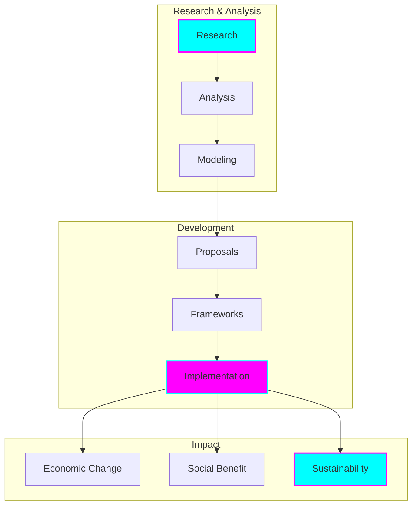
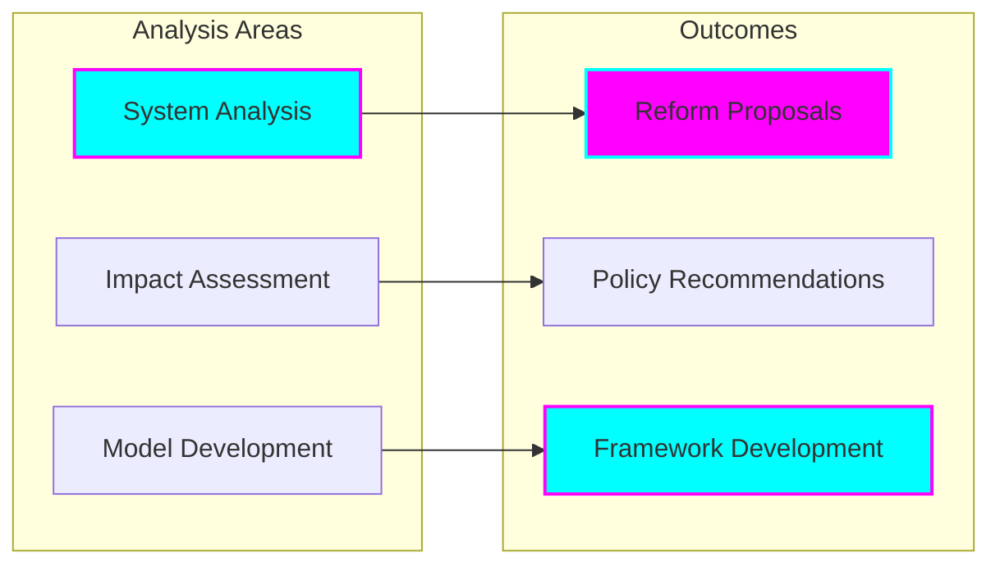
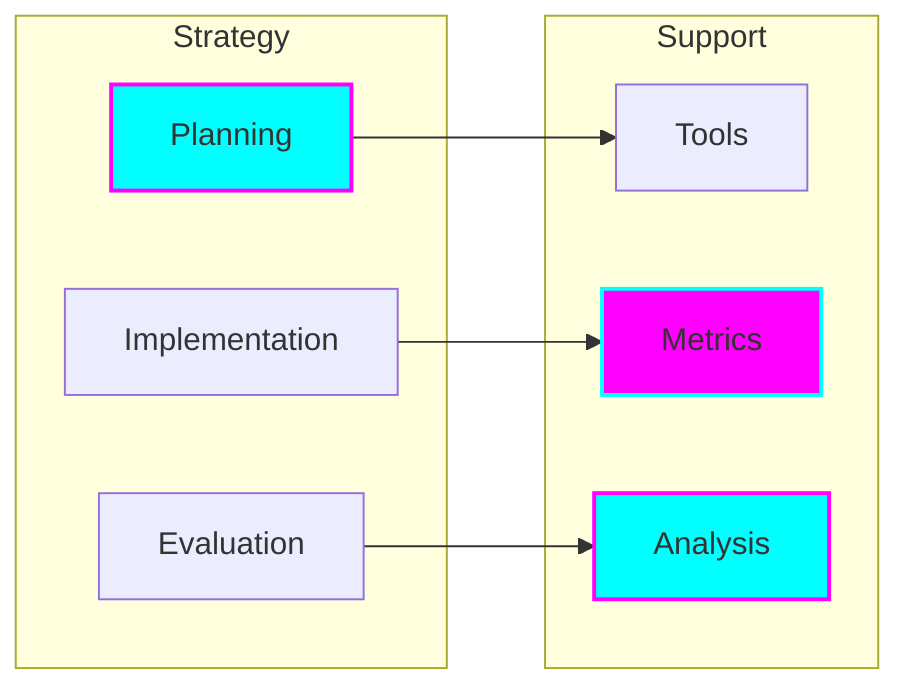

# Economic Reform Initiative

## Overview

Our economic reform initiative aims to create systemic change through innovative approaches to economic systems, focusing on sustainable development, social equity, and community prosperity.

## Framework

## Core Components

### Economic Analysis

### Implementation Strategy

## Research Areas

### System Analysis
- Current economic systems
- System inefficiencies
- Reform opportunities
- Impact assessment
- Risk analysis

### Model Development
- Economic modeling
- Impact prediction
- Scenario planning
- Risk assessment
- Sustainability analysis

### Policy Framework
- Policy development
- Implementation guidelines
- Regulatory considerations
- Compliance frameworks
- Monitoring systems

## Implementation Approach

### Phase 1: Research & Analysis
- System assessment
- Impact studies
- Model development
- Framework design
- Stakeholder engagement

### Phase 2: Development
- Policy creation
- Tool development
- Framework refinement
- Implementation planning
- Resource allocation

### Phase 3: Implementation
- Pilot programs
- Scaled deployment
- Monitoring systems
- Impact measurement
- Continuous improvement

## Impact Measurement

### Economic Metrics
- System efficiency
- Resource allocation
- Value creation
- Sustainable growth
- Economic stability

### Social Metrics
- Community benefit
- Social equity
- Quality of life
- Access to resources
- Opportunity creation

### Sustainability Metrics
- Environmental impact
- Resource efficiency
- Long-term viability
- System resilience
- Adaptive capacity

## Technology Integration

### Analysis Tools
- Economic modeling
- Data analytics
- Impact assessment
- Risk analysis
- Performance monitoring

### Implementation Platforms
- Policy management
- Resource allocation
- Impact tracking
- Stakeholder engagement
- Knowledge sharing

### Monitoring Systems
- Real-time analytics
- Performance tracking
- Impact measurement
- Risk monitoring
- Trend analysis

## Stakeholder Engagement

### Community Involvement
- Participatory design
- Local input
- Cultural integration
- Feedback systems
- Collaborative development

### Expert Consultation
- Economic advisors
- Policy experts
- Technical specialists
- Implementation partners
- Impact assessors

### Knowledge Sharing
- Research publications
- Case studies
- Best practices
- Implementation guides
- Impact reports

## Success Criteria

### System Effectiveness
- Economic efficiency
- Resource optimization
- Value creation
- Sustainable growth
- System stability

### Social Impact
- Community benefit
- Social equity
- Quality of life
- Resource access
- Opportunity creation

### Sustainability
- Environmental consideration
- Resource efficiency
- Long-term viability
- System resilience
- Adaptive capacity

## Future Development

### Research Extension
- Model refinement
- Impact analysis
- System optimization
- Policy development
- Framework enhancement

### Implementation Scaling
- Geographic expansion
- System integration
- Capacity building
- Resource development
- Partnership growth

### Impact Enhancement
- Effectiveness improvement
- Efficiency optimization
- Impact maximization
- Sustainability enhancement
- Value creation

## Commitment to Change

We are dedicated to:
- Systemic improvement
- Social benefit
- Sustainable development
- Evidence-based reform
- Community empowerment
- Inclusive growth
- Cultural respect
- Global impact
