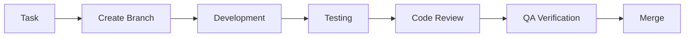
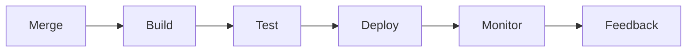
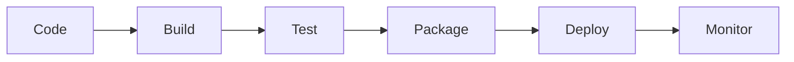
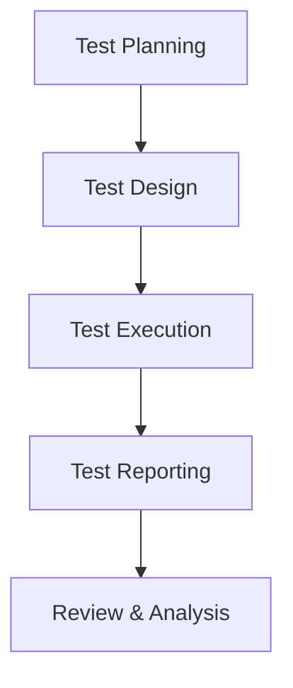

# Engineering Practices & Standards

## Development Standards

### Code Quality
- Static code analysis
- Code review guidelines
- Test coverage requirements
- Performance benchmarks
- Security scanning

### Version Control
- Git workflow
- Branch naming conventions
- Commit message standards
- Code review process
- Release management

### Documentation
- API documentation
- Architecture documentation
- Code documentation
- Deployment guides
- User guides

## Development Workflow

### Planning

### Development

### Deployment

## Testing Strategy

### Test Pyramid

### Test Types
- Unit Testing
- Integration Testing
- End-to-End Testing
- Performance Testing
- Security Testing

### Test Automation
- CI/CD Pipeline Integration
- Automated Test Suites
- Test Data Management
- Test Environment Management
- Test Result Reporting

## Security Practices

### Security Standards
- OWASP Guidelines
- Security Testing
- Vulnerability Scanning
- Penetration Testing
- Security Audits

### Security Implementation
- Authentication & Authorization
- Data Encryption
- Input Validation
- Error Handling
- Logging & Monitoring

## Performance Optimization

### Frontend Performance
- Load Time Optimization
- Code Splitting
- Asset Optimization
- Caching Strategies
- Performance Monitoring

### Backend Performance
- Query Optimization
- Caching Implementation
- Load Balancing
- Connection Pooling
- Resource Management

### Mobile Performance
- App Size Optimization
- Memory Management
- Battery Optimization
- Network Optimization
- UI Performance

## DevOps Practices

### CI/CD Pipeline

### Infrastructure as Code
- Resource Templates
- Configuration Management
- Environment Provisioning
- Scaling Policies
- Disaster Recovery

### Monitoring & Alerting
- System Metrics
- Application Metrics
- Log Management
- Alert Configuration
- Incident Response

## Quality Assurance

### QA Process

### Testing Tools
- Automated Testing Tools
- Performance Testing Tools
- Security Testing Tools
- Load Testing Tools
- Monitoring Tools

### Quality Metrics
- Code Coverage
- Test Coverage
- Performance Metrics
- Security Metrics
- User Satisfaction

## Continuous Improvement

### Process Optimization
- Regular Reviews
- Feedback Integration
- Process Updates
- Tool Evaluation
- Skill Development

### Knowledge Sharing
- Technical Documentation
- Team Training
- Code Reviews
- Pair Programming
- Tech Talks

### Innovation
- Research & Development
- Technology Evaluation
- Proof of Concepts
- Innovation Projects
- Technical Debt Management
