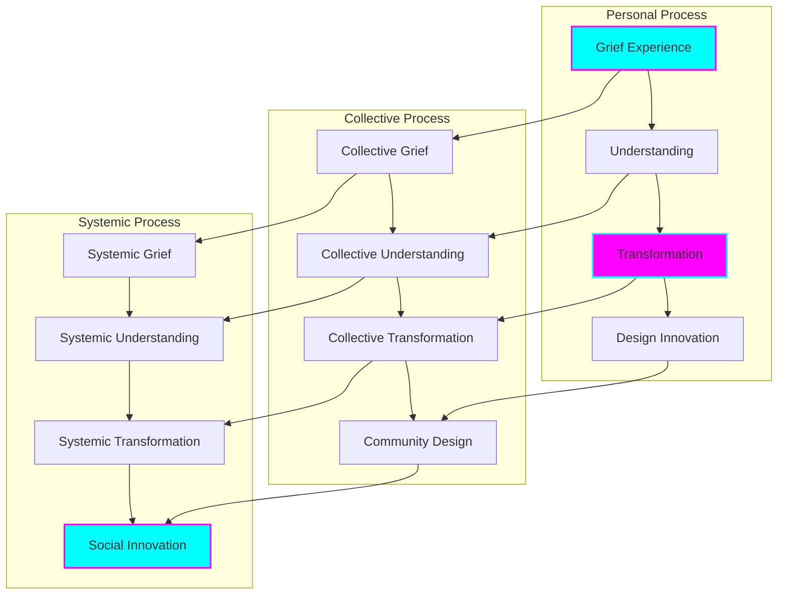
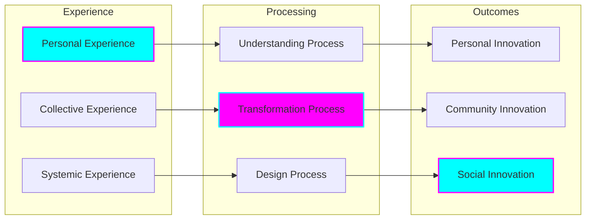
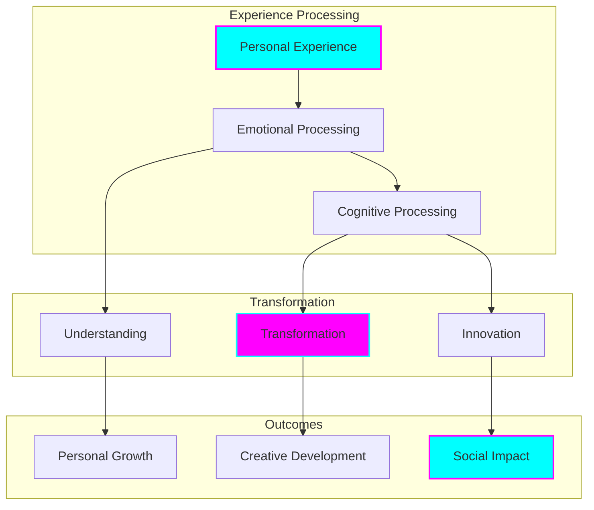
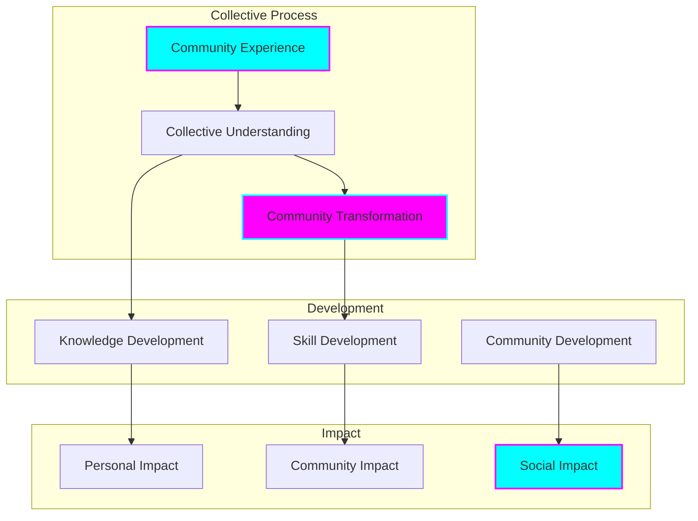
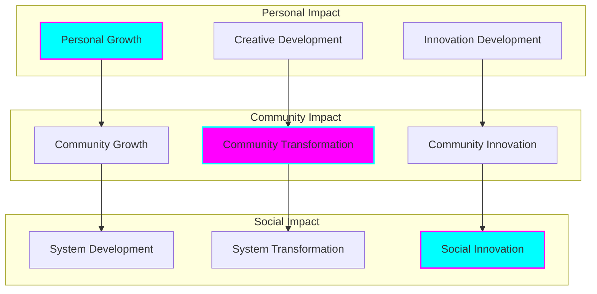
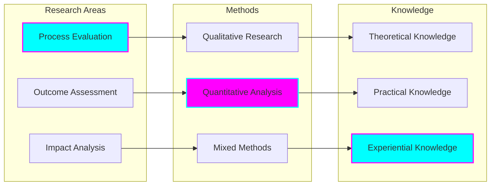

# Grief to Design Methodology

## Theoretical Foundation

### Transformation Framework

## Core Principles

### 1. Grief Understanding
- Personal experience recognition
- Collective grief acknowledgment
- Systemic impact awareness
- Cultural context consideration
- Emotional intelligence development

### 2. Transformation Process
- Experience processing
- Meaning making
- Pattern recognition
- Innovation potential
- Design thinking integration

### 3. Design Innovation
- Solution development
- Creative expression
- System redesign
- Impact creation
- Sustainable change

## Methodology Components

### Process Framework

## Implementation Levels

### Personal Level

### Community Level

## Application Areas

### Personal Development
- Experience processing
- Understanding development
- Transformation facilitation
- Innovation creation
- Impact generation

### Community Development
- Collective processing
- Shared understanding
- Community transformation
- Collaborative design
- Social innovation

### System Change
- Systemic analysis
- Pattern recognition
- System transformation
- Design implementation
- Impact assessment

## Impact Framework

### Assessment Areas

## Research Integration

### Research Framework

## Implementation Strategy

### Process Implementation
- Experience recognition
- Understanding development
- Transformation facilitation
- Design integration
- Impact creation

### Practice Development
- Methodology application
- Process refinement
- Outcome evaluation
- Impact assessment
- Knowledge development

### System Integration
- Framework application
- Process implementation
- Outcome measurement
- Impact evaluation
- Continuous improvement

## Success Metrics

### Personal Success
- Experience processing
- Understanding development
- Transformation achievement
- Innovation creation
- Impact generation

### Community Success
- Collective processing
- Shared understanding
- Community transformation
- Collaborative innovation
- Social impact

### System Success
- Pattern recognition
- System transformation
- Design implementation
- Impact creation
- Sustainable change

## Future Development

### Methodology Enhancement
- Process refinement
- Framework development
- Implementation improvement
- Impact optimization
- Knowledge expansion

### Practice Evolution
- Application development
- Process optimization
- Outcome enhancement
- Impact maximization
- System improvement

### Knowledge Advancement
- Theory development
- Practice progression
- Evidence building
- Understanding growth
- Application expansion
