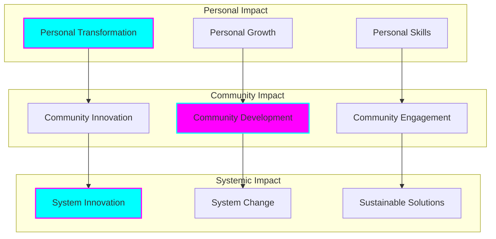
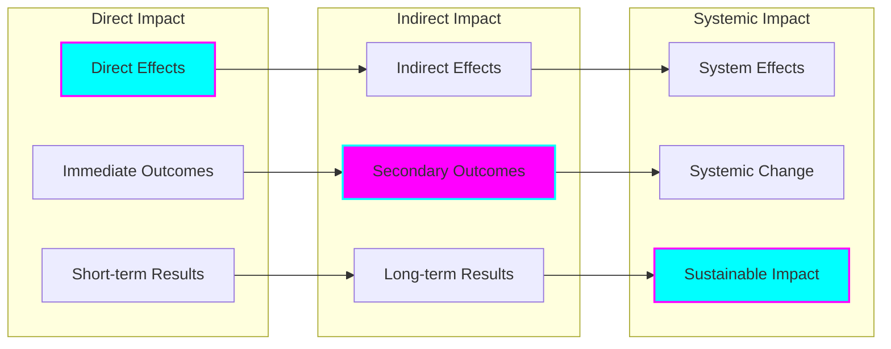
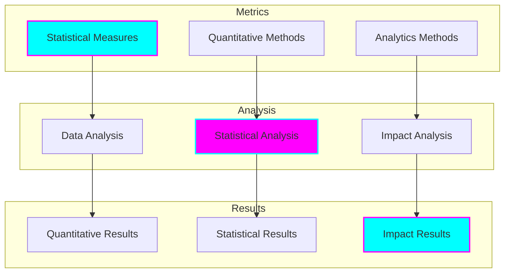
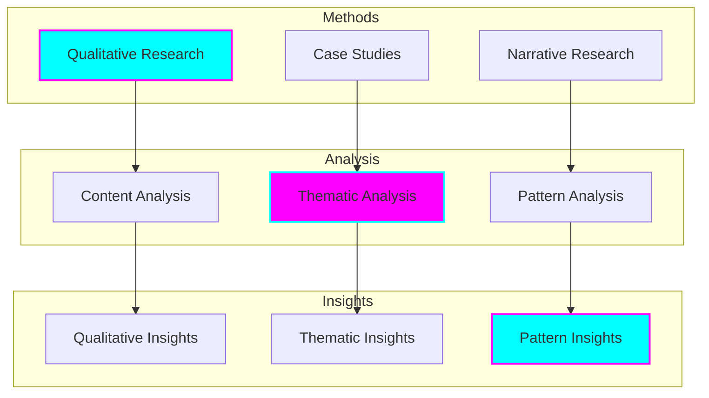
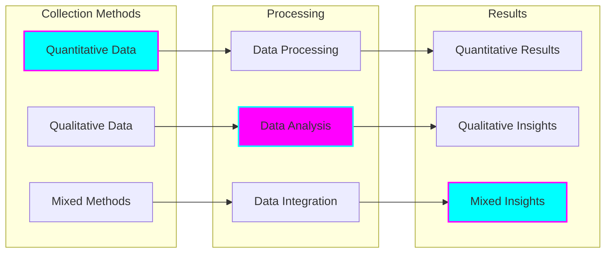
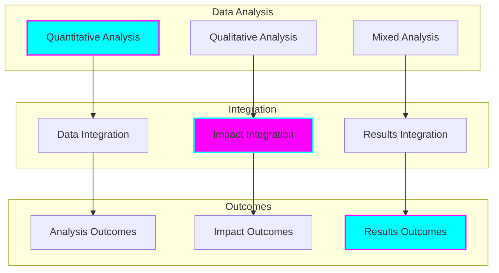

# Social Impact Assessment Framework

## Overview

Our comprehensive framework for assessing and measuring social impact across personal, community, and systemic levels. This framework ensures our initiatives create meaningful, sustainable change while adhering to ethical principles and community values.

## Impact Dimensions

## Assessment Framework

### Measurement Areas

## Evaluation Methods

### Quantitative Assessment

### Qualitative Assessment

## Impact Metrics

### Personal Level
- Transformation indicators
- Growth measurements
- Skill development metrics
- Wellbeing assessments
- Personal achievement metrics

### Community Level
- Engagement rates
- Participation metrics
- Development indicators
- Innovation measures
- Collaboration metrics

### Systemic Level
- Change indicators
- Innovation metrics
- Sustainability measures
- Impact assessments
- Transformation metrics

## Assessment Process

### Data Collection

## Impact Analysis

### Analysis Framework

## Reporting Framework

### Report Types
- Impact Reports
- Progress Updates
- Outcome Assessments
- Stakeholder Reports
- Community Feedback

### Report Components
- Executive Summary
- Methodology
- Results Analysis
- Impact Assessment
- Recommendations

### Report Distribution
- Stakeholder Groups
- Community Members
- Partner Organizations
- Funding Bodies
- Public Access

## Continuous Improvement

### Process Enhancement
- Methodology Refinement
- Tool Optimization
- Framework Development
- Process Improvement
- System Enhancement

### Impact Optimization
- Result Analysis
- Impact Enhancement
- Outcome Optimization
- Effect Maximization
- Value Creation

### Knowledge Development
- Learning Integration
- Knowledge Sharing
- Best Practices
- Innovation Development
- Continuous Learning

## Future Development

### Framework Evolution
- Methodology Enhancement
- Tool Development
- Process Optimization
- Impact Maximization
- System Improvement

### Practice Advancement
- Implementation Refinement
- Process Development
- Outcome Enhancement
- Impact Optimization
- Value Creation

### Knowledge Growth
- Theory Development
- Practice Advancement
- Evidence Building
- Understanding Enhancement
- Application Expansion

## Commitment to Excellence

We are committed to:
- Rigorous Assessment
- Transparent Reporting
- Continuous Improvement
- Stakeholder Engagement
- Impact Maximization
- Sustainable Development
- Knowledge Sharing
- Innovation Advancement
