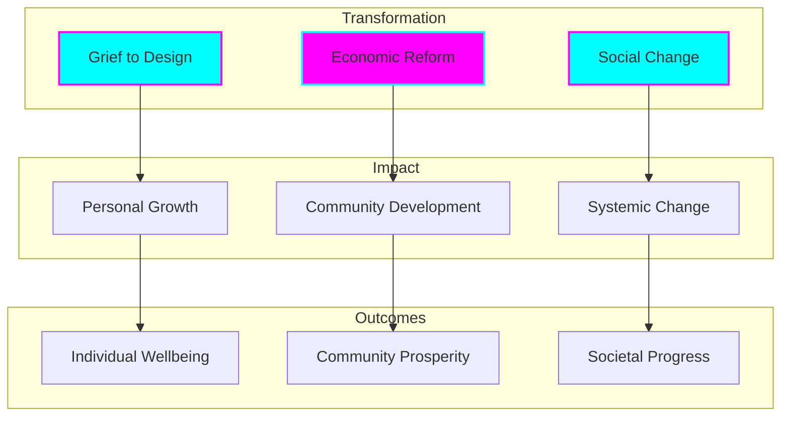
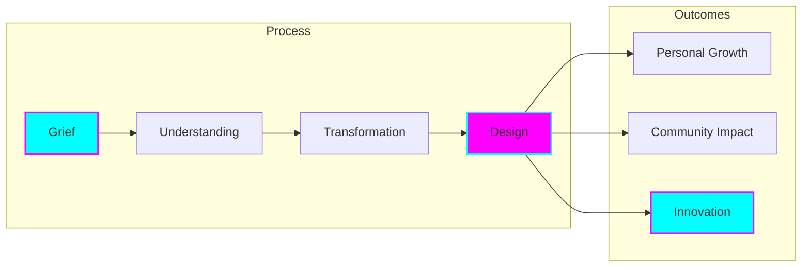
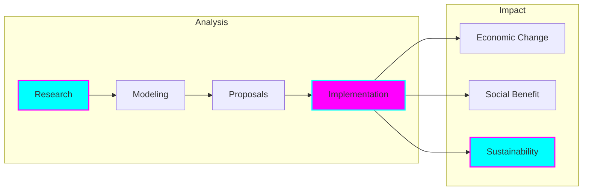
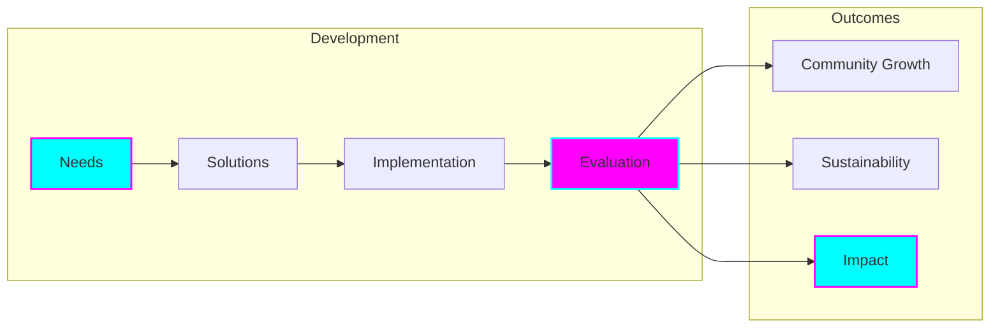

# Mission & Vision

## Core Purpose

Our NGO is dedicated to transformative social and economic change through innovative approaches to grief processing and economic reform. We believe in the power of transforming personal and collective grief into meaningful design solutions while simultaneously working towards comprehensive economic reform that benefits society as a whole.

## Vision Statement

## Core Values

### 1. Transformative Impact
- Converting grief into positive design outcomes
- Driving meaningful economic reform
- Creating sustainable social change

### 2. Ethical Innovation
- Technology for social good
- Ethical AI development
- Sustainable solutions

### 3. Community Focus
- Inclusive development
- Cultural sensitivity
- Stakeholder engagement

### 4. Evidence-Based Approach
- Research-driven solutions
- Data-informed decisions
- Measurable outcomes

## Strategic Pillars

### 1. Grief to Design

### 2. Economic Reform

### 3. Social Innovation

## Implementation Framework

### Research & Development
- Evidence-based methodologies
- Rigorous analysis
- Continuous evaluation
- Knowledge sharing

### Community Engagement
- Stakeholder participation
- Cultural integration
- Local empowerment
- Collaborative design

### Technology Application
- Ethical development
- Accessible solutions
- Sustainable systems
- Impact measurement

## Impact Areas

### Individual Level
- Personal transformation
- Skill development
- Economic opportunity
- Wellbeing improvement

### Community Level
- Collective growth
- Economic development
- Social cohesion
- Cultural preservation

### Systemic Level
- Economic reform
- Policy influence
- Social change
- Sustainable development

## Success Metrics

### Transformation Metrics
- Grief processing outcomes
- Design implementation
- Community engagement
- Personal growth

### Economic Metrics
- Reform implementation
- Economic impact
- Sustainability measures
- System efficiency

### Social Metrics
- Community wellbeing
- Cultural integration
- Social cohesion
- Sustainable change

## Future Vision

### Short-term Goals (1-2 Years)
- Establish transformation methodologies
- Implement initial economic reforms
- Build community partnerships
- Develop impact measurement

### Medium-term Goals (3-5 Years)
- Scale successful programs
- Expand geographic reach
- Deepen economic impact
- Strengthen evidence base

### Long-term Goals (5+ Years)
- Systemic economic change
- Global methodology adoption
- Sustainable social impact
- Cultural transformation

## Commitment to Change

We are committed to:
- Ethical practice
- Sustainable development
- Community empowerment
- Evidence-based solutions
- Continuous learning
- Inclusive growth
- Cultural respect
- Global impact
