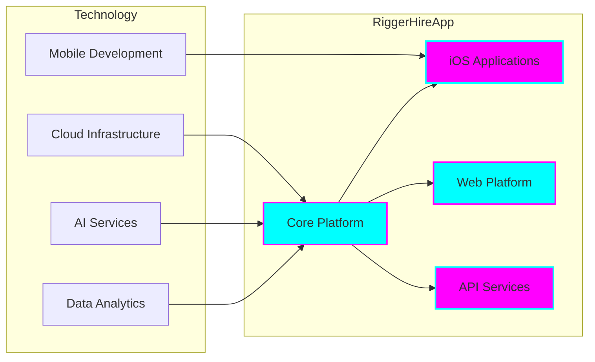
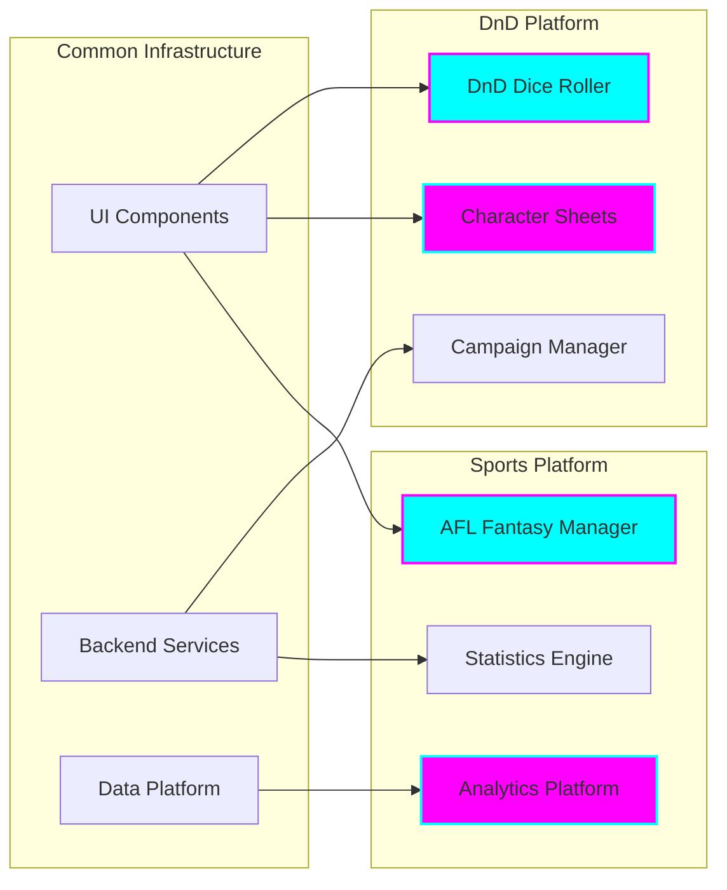
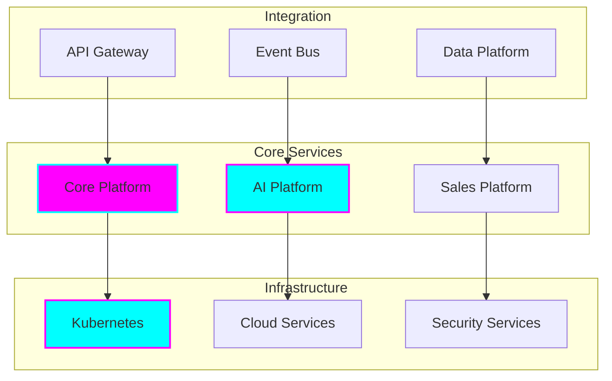

# Organization Overview

## Enterprise Solutions Portfolio

### Brand Identity
```mermaid
graph TB
    subgraph Visual Identity
        style[Dark Neon Theme]
        colors[Cyan/Magenta Gradients]
        approach[Mobile-First Design]
    end

    subgraph Core Values
        innovation[Innovation]
        quality[Enterprise Quality]
        accessibility[Universal Access]
    end

    subgraph Standards
        tech[TypeScript & Testing]
        security[Enterprise Security]
        compliance[WCAG Compliance]
    end
```

## Business Divisions

### Rigger Platform
*Enterprise Recruitment Solutions*



### Gaming Solutions
*Enterprise Gaming Platforms*



### Platform Services
*Enterprise Infrastructure*



## Technical Standards

### Development Standards
- TypeScript throughout all projects
- Comprehensive testing suites
- Enterprise-grade security practices
- WCAG compliance for accessibility
- Robust error handling and logging
- Automated CI/CD pipelines

### Visual Standards
- Dark neon theme implementation
- Cyan/magenta gradient system
- Mobile-first responsive design
- Enterprise-grade UI components
- Consistent brand identity

### Quality Standards
- Enterprise-grade code quality
- Comprehensive documentation
- Security-first development
- Performance optimization
- Accessibility compliance

## Research & Innovation

### Economic Innovation
- Economic reform research
- Proposal development
- Impact analysis
- Implementation strategies
- Stakeholder engagement

### Design Methodology
- Design thinking principles
- Transformation methodologies
- User-centered design
- Innovation frameworks
- Research integration

## Product Portfolio

### Enterprise Solutions
- RiggerHireApp Platform
- Gaming Solutions Suite
- AI & Platform Services
- Infrastructure Solutions
- SaaS Applications

### Mobile Applications
- RiggerHireApp iOS
- DnD Dice Roller
- AFL Fantasy Manager
- Enterprise Tools
- Utility Applications

### Platform Services
- AI Platform
- Core Platform
- Sales Platform
- Infrastructure
- Integration Services

## Market Focus

### Industry Sectors
- Construction & Mining
- Gaming & Entertainment
- Enterprise Software
- Platform Services
- Infrastructure Solutions

### Geographic Focus
- Western Australia Primary
- Australia Secondary
- Global Tertiary
- Digital Presence
- Cloud Distribution

## Innovation Focus

### Current Initiatives
- AI Integration
- Platform Evolution
- Mobile Innovation
- Infrastructure Automation
- Security Enhancement

### Research Areas
- Economic Reform
- Design Methodology
- AI Applications
- Platform Architecture
- User Experience

## Enterprise Standards

### Technical Excellence
- Enterprise-grade quality
- Comprehensive testing
- Security-first approach
- Performance optimization
- Scalable architecture

### Business Alignment
- Industry focus
- Market adaptation
- Innovation drive
- Customer centricity
- Value delivery

### Operational Excellence
- Process automation
- Quality assurance
- Security compliance
- Performance monitoring
- Continuous improvement
