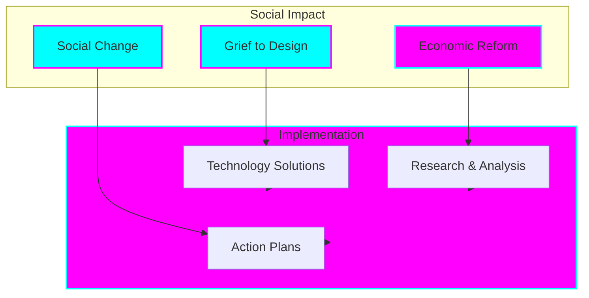
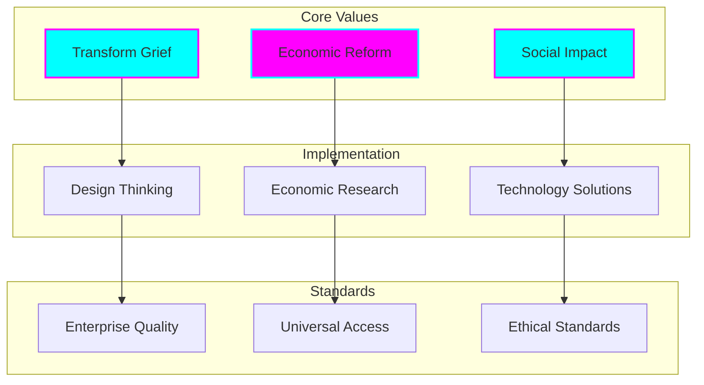
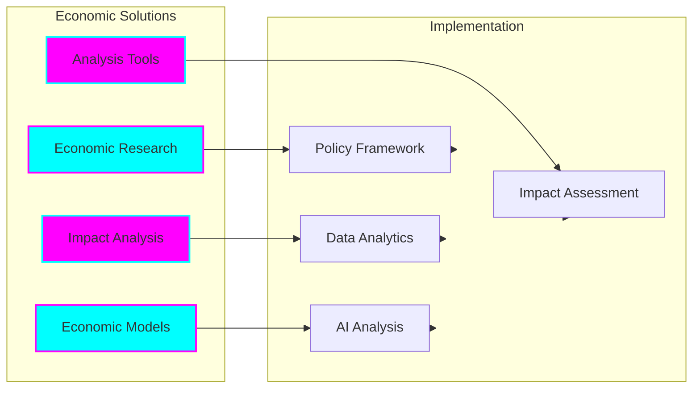
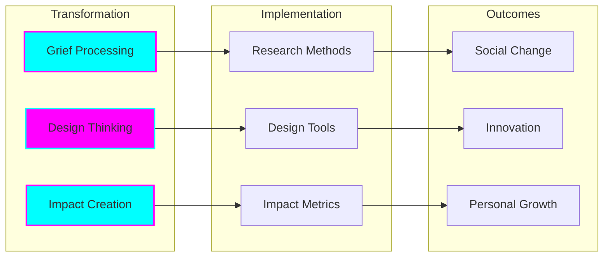
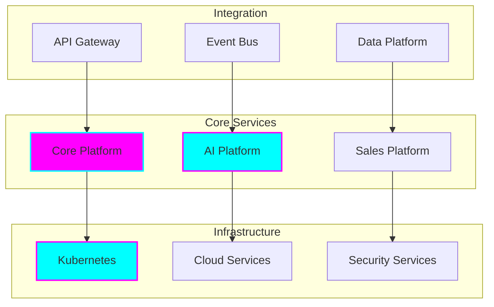

# Organization Overview

## Social Impact & Economic Reform Focus

ChaseWhiteRabbit is a non-governmental organization (NGO) dedicated to driving positive social change and economic reform through innovative technology solutions. Our mission is to transform grief into meaningful design and implement economic reforms that benefit society as a whole.

### Core Mission

## Organization Portfolio

### Organization Identity

## Impact Initiatives

### Economic Reform Platform
*Innovative Economic Solutions*

### Social Impact Solutions
*Transform Grief to Design*

### Support Services
*Technology Infrastructure*

## Organization Standards

### Core Values
- Social impact through innovation
- Economic reform for societal benefit
- Transformation of grief into design
- Universal accessibility and inclusion
- Ethical technology development

### Development Standards
- Evidence-based research methodology
- Comprehensive impact assessment
- Inclusive design practices
- Universal accessibility
- Ethical data handling

### Research Standards
- Rigorous methodology
- Peer review process
- Data-driven analysis
- Ethical considerations
- Impact assessment

### Impact Standards
- Measurable outcomes
- Community engagement
- Sustainable solutions
- Ethical implementation
- Continuous evaluation

## Research & Impact

### Economic Reform
- Economic system analysis
- Reform proposals
- Implementation frameworks
- Impact assessment
- Policy recommendations

### Grief to Design
- Transformation methodology
- Design thinking application
- Community engagement
- Impact measurement
- Knowledge sharing

### Social Innovation
- Community-driven solutions
- Ethical technology
- Inclusive design
- Sustainable impact
- Cultural consideration

## Initiative Portfolio

### Economic Reform
- Economic Analysis Platform
- Reform Implementation Framework
- Impact Assessment Tools
- Policy Development Platform
- Data Analytics Suite

### Social Transformation
- Grief to Design Platform
- Community Engagement Tools
- Impact Measurement System
- Knowledge Sharing Platform
- Collaboration Framework

### Support Infrastructure
- Research Platform
- Analysis Tools
- Data Management
- Collaboration Systems
- Impact Tracking

## Impact Focus

### Social Sectors
- Economic Reform
- Social Transformation
- Community Development
- Cultural Change
- Sustainable Impact

### Research Areas
- Economic Systems
- Social Innovation
- Grief Processing
- Design Thinking
- Impact Assessment

### Geographic Scope
- Local Communities
- National Impact
- Global Influence
- Digital Reach
- Cultural Adaptation

## Change Focus

### Current Initiatives
- Economic System Reform
- Grief Transformation
- Community Engagement
- Impact Measurement
- Knowledge Sharing

### Research Areas
- Economic Reform Models
- Social Impact Assessment
- Transformation Methodologies
- Community Development
- Sustainable Change

### Technology Focus
- Ethical AI Development
- Inclusive Design
- Accessible Platforms
- Data Privacy
- Sustainable Solutions

## Organization Excellence

### Research Excellence
- Evidence-based methodology
- Rigorous analysis
- Peer review process
- Impact assessment
- Knowledge sharing

### Social Impact
- Community engagement
- Cultural sensitivity
- Ethical considerations
- Sustainable outcomes
- Measurable change

### Implementation Excellence
- Systematic approach
- Quality assurance
- Impact monitoring
- Continuous improvement
- Stakeholder involvement

### Technical Standards
- Ethical technology
- Inclusive design
- Accessibility
- Data privacy
- Sustainable development
