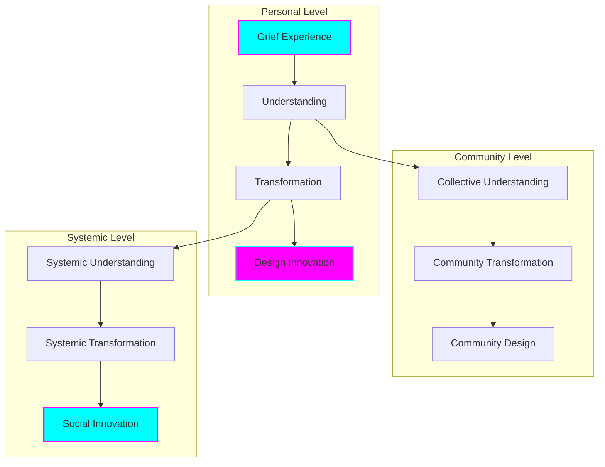
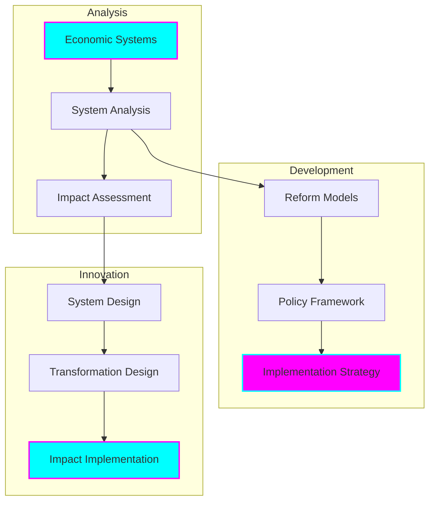
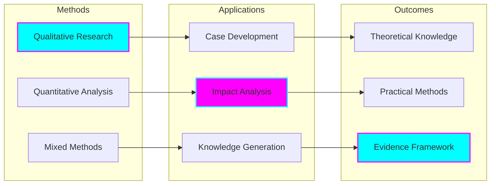
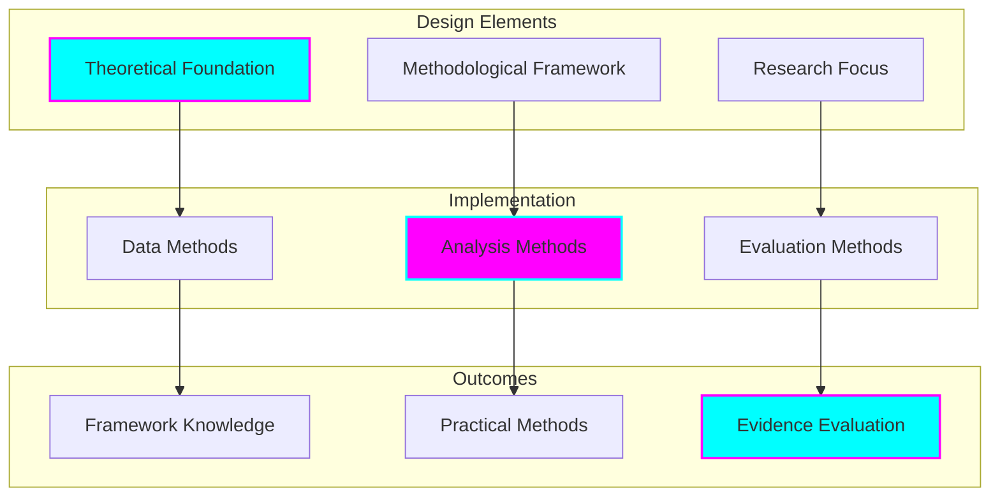
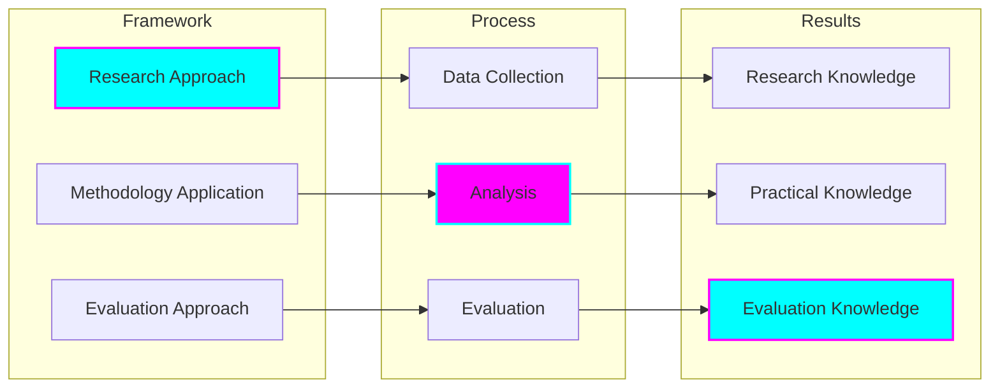
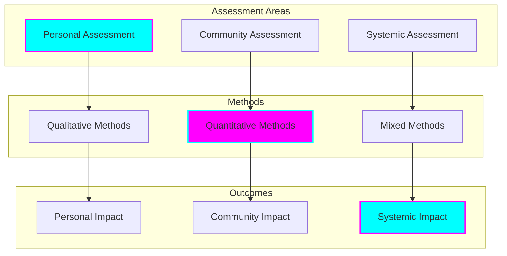
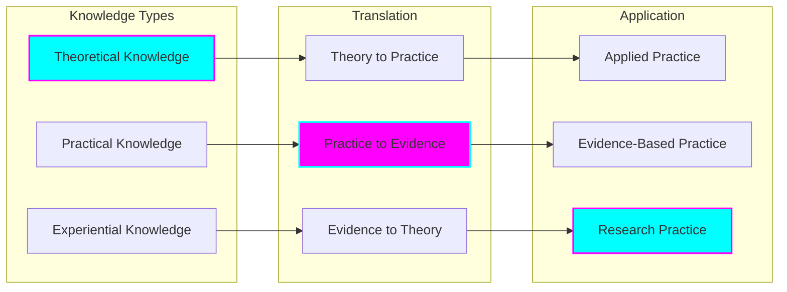

# Research & Methodology

## Theoretical Framework

### Grief to Design Transformation

### Economic Reform Framework

## Research Methodologies

### Transformative Research

## Core Research Areas

### 1. Grief Processing & Transformation
- Psychological foundations
- Transformation mechanisms
- Design thinking integration
- Impact measurement
- Outcome evaluation

### 2. Economic System Analysis
- Current system assessment
- Reform opportunities
- Impact modeling
- Implementation frameworks
- Success metrics

### 3. Social Innovation
- Community engagement
- Participatory design
- Impact assessment
- Sustainable development
- Cultural integration

## Methodology Components

### Research Design

### Implementation Framework

## Research Ethics

### Ethical Framework
- Participant protection
- Community benefit
- Cultural respect
- Sustainable impact
- Knowledge sharing

### Implementation Ethics
- Informed consent
- Data protection
- Privacy assurance
- Impact consideration
- Community engagement

### Research Integrity
- Methodological rigor
- Data accuracy
- Analysis transparency
- Result validation
- Knowledge dissemination

## Impact Assessment

### Assessment Framework

## Knowledge Translation

### Translation Framework

## Implementation Strategy

### Research Implementation
- Methodology application
- Data collection
- Analysis processes
- Result validation
- Knowledge dissemination

### Practice Implementation
- Framework application
- Process integration
- Impact assessment
- Outcome evaluation
- Continuous improvement

### Knowledge Implementation
- Theory integration
- Practice development
- Evidence building
- Knowledge sharing
- Community engagement

## Continuous Development

### Research Evolution
- Methodology refinement
- Framework enhancement
- Process improvement
- Impact optimization
- Knowledge expansion

### Practice Enhancement
- Implementation improvement
- Process optimization
- Impact maximization
- Outcome enhancement
- System development

### Knowledge Growth
- Theory development
- Practice advancement
- Evidence strengthening
- Understanding deepening
- Application broadening

## Future Directions

### Research Focus
- Methodology advancement
- Framework development
- Process innovation
- Impact enhancement
- Knowledge expansion

### Practice Development
- Implementation refinement
- Process optimization
- Impact maximization
- Outcome improvement
- System enhancement

### Knowledge Advancement
- Theory evolution
- Practice progression
- Evidence building
- Understanding growth
- Application expansion
