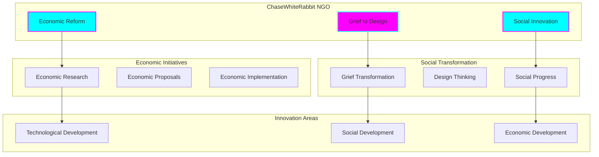
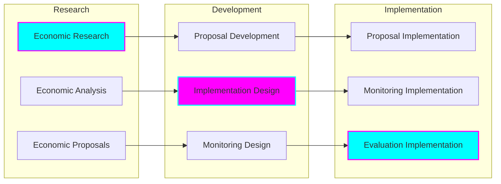
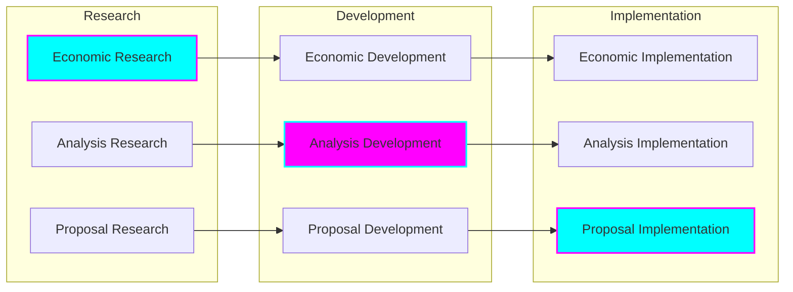
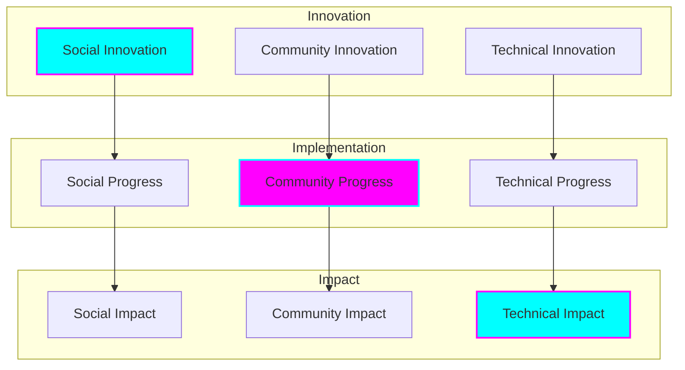

# Strategic Alignment with ChaseWhiteRabbit NGO

## Overview

This document outlines how our work aligns with and supports ChaseWhiteRabbit's mission of economic and social reform through the transformation of grief into meaningful design solutions and innovative economic approaches.

## Organizational Structure

## Core Mission Alignment

### Economic Reform Focus

### Grief to Design Process

```mermaid
graph TB
    subgraph Personal
        PE[Personal Experience]
        PT[Personal Transformation]
        PD[Personal Design]
    end

    subgraph Community
        CE[Community Experience]
        CT[Community Transformation]
        CD[Community Design]
    end

    subgraph System
        SE[System Experience]
        ST[System Transformation]
        SD[System Design]
    end

    PE --> PT --> PD
    CE --> CT --> CD
    SE --> ST --> SD

    style PE fill:#00ffff,stroke:#ff00ff,stroke-width:2px
    style CT fill:#ff00ff,stroke:#00ffff,stroke-width:2px
    style SD fill:#00ffff,stroke:#ff00ff,stroke-width:2px
```

## Strategic Integration

### Economic Reform Integration
- Research and analysis contribution
- Proposal development support
- Implementation expertise
- Monitoring and evaluation
- Impact assessment

### Social Transformation
- Grief processing methodology
- Design thinking integration
- Community engagement
- Social innovation
- Impact creation

### Technical Implementation
- Platform development
- System implementation
- Tool creation
- Process automation
- Impact measurement

## Key Initiatives

### Economic Reform

### Social Innovation

## Implementation Areas

### Economic Reform
- Economic research
- System analysis
- Proposal development
- Implementation design
- Impact assessment

### Social Transformation
- Grief processing
- Design thinking
- Community engagement
- Social innovation
- Impact creation

### Technical Development
- Platform creation
- Tool development
- System implementation
- Process automation
- Impact measurement

## Success Metrics

### Economic Impact
- Reform implementation
- System efficiency
- Economic benefit
- Sustainable development
- Impact measurement

### Social Impact
- Transformation success
- Community benefit
- Innovation creation
- Sustainable change
- Impact assessment

### Technical Impact
- System implementation
- Tool effectiveness
- Process efficiency
- Automation success
- Impact measurement

## Future Development

### Strategic Enhancement
- Research advancement
- Methodology development
- Implementation improvement
- Impact optimization
- System enhancement

### Process Evolution
- Method refinement
- Tool development
- System optimization
- Impact maximization
- Continuous improvement

### Impact Advancement
- Measurement enhancement
- Assessment improvement
- Evaluation development
- Impact optimization
- Sustainable progress

## Strategic Alignment

### Mission Alignment
- Economic reform focus
- Social transformation
- Technical innovation
- Impact creation
- Sustainable development

### Value Alignment
- Community focus
- Innovation drive
- Sustainable approach
- Impact orientation
- Continuous improvement

### Implementation Alignment
- Research integration
- Development coordination
- Implementation synergy
- Impact collaboration
- Continuous enhancement

## Commitment

### Economic Reform
- Research contribution
- Analysis support
- Proposal development
- Implementation assistance
- Impact assessment

### Social Transformation
- Methodology development
- Process implementation
- Community engagement
- Innovation creation
- Impact generation

### Technical Innovation
- Platform development
- Tool creation
- System implementation
- Process automation
- Impact measurement

## Future Vision

We are committed to advancing ChaseWhiteRabbit's mission through:
- Economic research and reform
- Social transformation
- Technical innovation
- Community engagement
- Impact creation
- Sustainable development
- Continuous improvement
- Knowledge sharing
