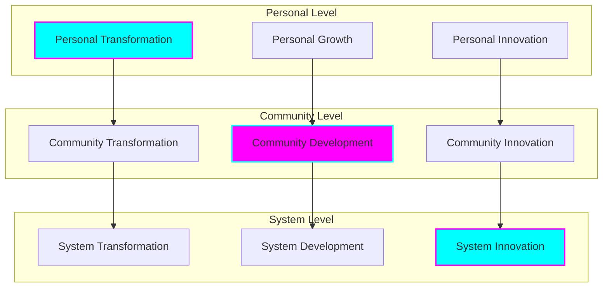
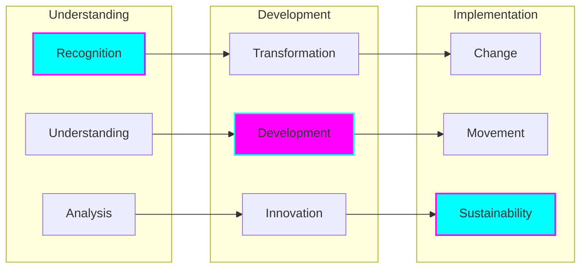
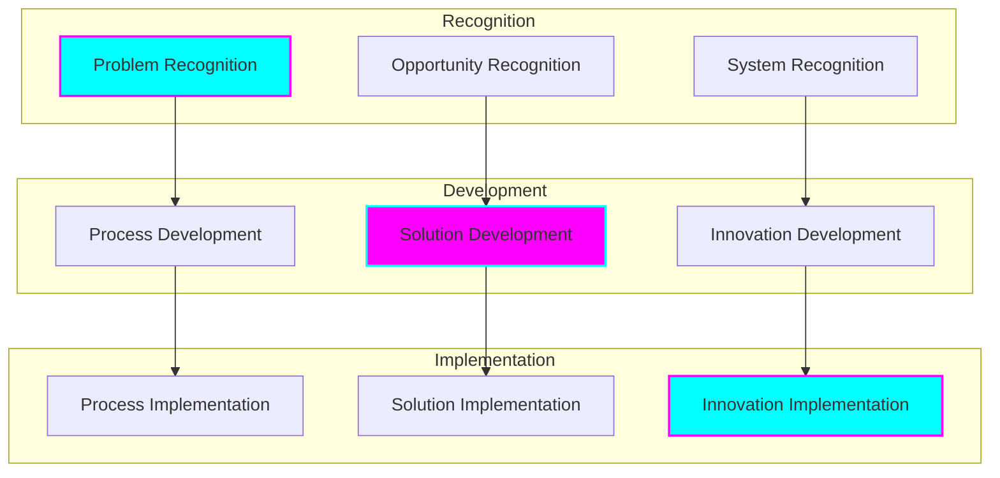
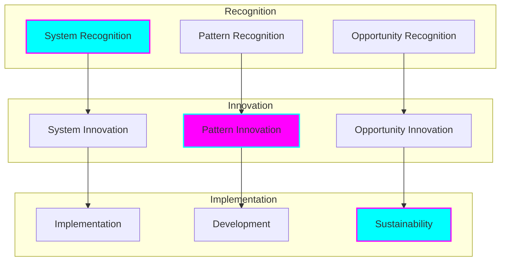
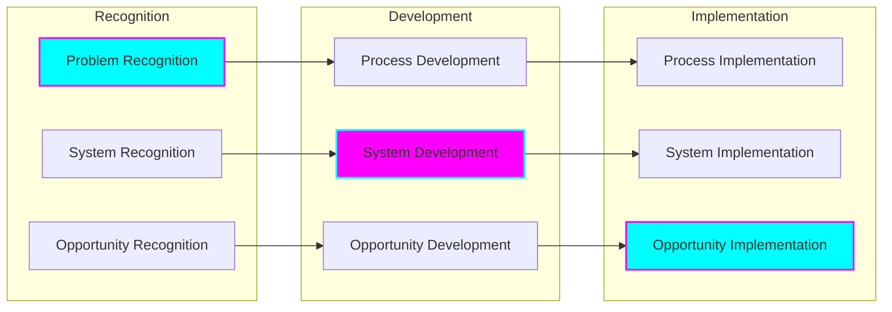

# Systemic Change Strategy

## Overview

Our approach to creating lasting, meaningful change through systematic transformation of social and economic systems. This strategy integrates personal transformation, community development, and systemic innovation to achieve sustainable impact.

## Change Framework

## Transformation Process

### Change Pathway

## Implementation Strategy

### Process Framework

## Change Components

### Personal Change
- Experience recognition
- Understanding development
- Transformation process
- Innovation creation
- Impact generation

### Community Change
- Collective awareness
- Shared understanding
- Community transformation
- Collaborative innovation
- Sustainable impact

### System Change
- System recognition
- Pattern identification
- Transformation design
- Innovation implementation
- Sustainable development

## Impact Areas

### Social Systems

## Change Metrics

### Transformation Metrics
- Change indicators
- Growth measurements
- Innovation metrics
- Impact assessments
- Sustainability measures

### Development Metrics
- Process indicators
- Progress measurements
- Development metrics
- Implementation assessments
- Outcome measures

### Innovation Metrics
- Innovation indicators
- Creation measurements
- Development metrics
- Implementation assessments
- Impact measures

## Implementation Process

### Process Framework

## Success Factors

### Personal Success
- Transformation achievement
- Growth development
- Innovation creation
- Impact generation
- Sustainable change

### Community Success
- Collective transformation
- Shared development
- Collaborative innovation
- Community impact
- Sustainable change

### System Success
- System transformation
- Pattern development
- Innovation implementation
- Systemic impact
- Sustainable change

## Future Development

### Strategy Enhancement
- Process refinement
- Framework development
- Implementation improvement
- Impact optimization
- System enhancement

### Practice Evolution
- Application development
- Process optimization
- Outcome enhancement
- Impact maximization
- System improvement

### Knowledge Advancement
- Theory development
- Practice progression
- Evidence building
- Understanding growth
- Application expansion

## Commitment to Change

We are committed to:
- Systemic transformation
- Sustainable development
- Community empowerment
- Innovation creation
- Impact generation
- Knowledge sharing
- Continuous improvement
- Lasting change
